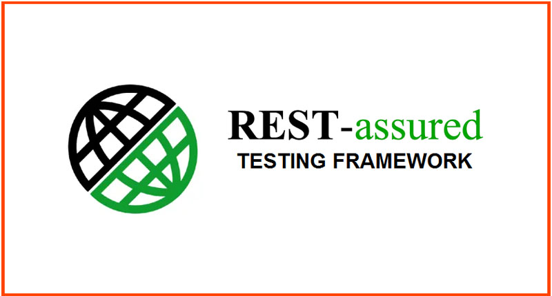

# API-Automation-Framework
## General
The purpose of this project is to demonstrate the testing of a simple API framework (https://swapi.dev/) using Java.

Other technologies used:

## Get started
### Pre-requisites for running locally

- [Install Gauge](https://docs.gauge.org/getting_started/installing-gauge.html)
- [Java](https://www.java.com/en/download/)
- [Maven](https://maven.apache.org/)

To run the existing test suite (having the tag "smoke"), the following command can be used from the terminal window; the user should first change directory to the project root.

***mvn clean install gauge:execute -Dtags="smoke" -Dflags=--max-retries-count=3***

### Github CI/CD

The easiest way to run the project is to use the Github pipeline already created: "Java CI with Maven".
As a contributor to the project, you should go to the Actions tab, select the mentioned workflow and press "Run workflow" in the right-side window.
This will launch the suite and publish the report at this address: https://robisaveanu.github.io/. Building the page can take a few minutes, please be patient. 

### Describing the test suite

3 tests are offered as examples for what the framework could do.
In the final test report, 2 of the tests should be red (fail) and one green (pass).
The report contains detailed information on the cause of the failures.
 - **SWAPI Contract**: uses a parametrized step to check the response format against a schema that has been saved within the project (in the folder "resources"). The SWAPI API actually offers no schema, these files have been generated from previous responses. One of the files has been tampered with, in order to provoke an error. One of the steps uses an incorrect parameter, just to show multiple types of failure in the report.
 - **SWAPI BUG**: as mentioned, the **/{resource}/schema** endpoints present in the API documentation don't actually function: they return the status **404 Not found**
 - **SWAPI Functional**: contains a few tests on API data. The first one demonstrates the use of the Gauge parameter table. The second cross-checks information between the /films and /people endpoints: for a given movie having a list of characters, each character's endpoint is called and the presence of the movie is verified.